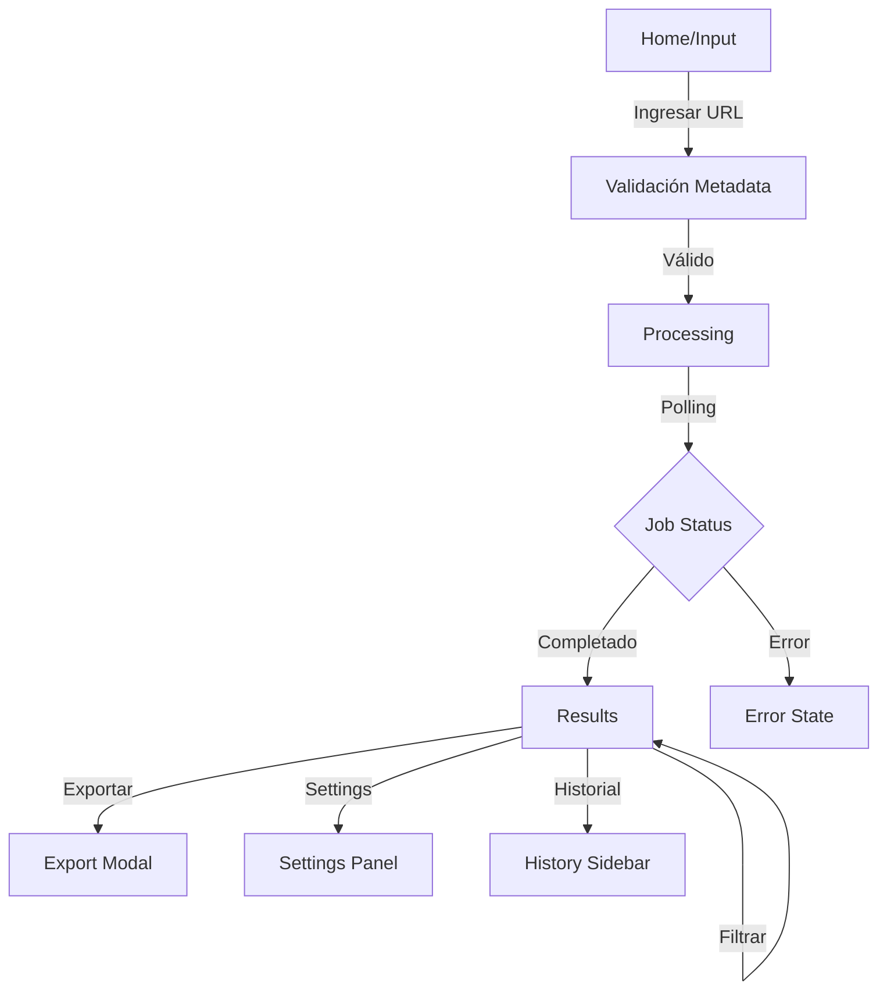

# Plan de Desarrollo Frontend - Clip Tool UI (Sprint 6)

## 1. Descripción General del Producto

Clip Tool es una aplicación web que permite a los usuarios procesar videos de YouTube para generar clips virales automáticamente. La interfaz permite ingresar URLs, monitorear el progreso de procesamiento, visualizar clips generados con análisis de viralidad, y exportar contenido en múltiples formatos.

### Problema que resuelve
- Automatiza la creación de clips virales a partir de videos largos
- Reduce el tiempo de edición manual de contenido
- Proporciona análisis de viralidad para optimizar el contenido

### Usuarios objetivo
- Creadores de contenido
- Editores de video
- Marketers digitales
- Agencias de medios

## 2. Características Principales

### 2.1 Páginas Principales

1. **Página de Inicio (Input)**: Campo de entrada URL con validación en tiempo real y preview de metadata
2. **Página de Procesamiento**: Barra de progreso multi-step con polling al backend
3. **Página de Resultados**: Grid de clips con reproductor de video y análisis de viralidad
4. **Panel de Configuración**: Gestión de API keys, modelos y preferencias
5. **Historial de Trabajos**: Sidebar con trabajos recientes

### 2.2 Módulos por Página

| Página | Módulo | Descripción de Características |
|--------|---------|-------------------------------|
| Home | Input URL | Validación en tiempo real, preview de thumbnail, título y duración |
| Processing | Progress Bar | Estados: Downloading → Transcribing → Analyzing → Generating |
| Results | Video Grid | Grid responsivo de tarjetas de clips con reproductor integrado |
| Results | Viral Score | Badge color-coded según puntuación de viralidad |
| Results | Filters Panel | Filtros por score mínimo, categoría, duración |
| Export | Modal Individual | Selector de formato (MP4+subs, MP4 clean, SRT) y aspect ratio |
| Export | Bulk Export | Botón de export masivo en formato ZIP |
| Settings | Configuration Panel | Idioma, modelo Whisper, estilo subtítulos, provider LLM, API keys |
| History | Recent Jobs | Lista de trabajos recientes con estado y fecha |

## 3. Flujo de Usuario

### Flujo Principal
1. Usuario ingresa URL de YouTube en la página de inicio
2. Sistema valida URL y muestra metadata del video
3. Usuario confirma y el sistema inicia el procesamiento
4. Usuario monitorea el progreso en tiempo real
5. Sistema muestra clips generados con análisis de viralidad
6. Usuario filtra y selecciona clips para exportar
7. Usuario descarga clips en formato deseado

## 4. Diseño de Interfaz

### 4.1 Estilo Visual
- **Modo**: Dark mode por defecto
- **Colores Primarios**: Slate 900 (fondo), Slate 100 (texto)
- **Colores de Acento**: Blue 500 (primario), Purple 500 (secundario)
- **Botones**: Estilo rounded con hover states y transiciones suaves
- **Tipografía**: Inter font family, tamaños responsive
- **Layout**: Card-based con grid system
- **Iconos**: Lucide React con estilo consistente

### 4.2 Elementos de UI por Página

| Página | Módulo | Elementos de UI |
|--------|---------|-----------------|
| Home | Input Section | Input field grande con icono de URL, botón de submit, preview card con thumbnail |
| Processing | Progress Bar | Barra horizontal con steps, porcentaje de progreso, mensajes de estado |
| Results | Video Card | Thumbnail con play overlay, viral score badge, título, duración, categoría |
| Results | Filter Panel | Dropdowns y sliders para filtros, botón de aplicar/clear |
| Export | Modal | Radio buttons para formato, selector de aspect ratio, botón de descarga |
| Settings | Config Panel | Form inputs para API keys, dropdowns para modelos, toggles para opciones |

### 4.3 Responsividad
- **Enfoque**: Desktop-first con adaptación mobile
- **Breakpoints**: sm (640px), md (768px), lg (1024px), xl (1280px)
- **Grid**: Responsive con columnas adaptativas
- **Touch**: Optimizado para interacción táctil en dispositivos móviles

### 4.4 Estados de UI
- **Skeleton Loaders**: Durante carga de datos
- **Empty States**: Mensajes cuando no hay contenido
- **Error States**: Mensajes de error con acciones correctivas
- **Toast Notifications**: Para acciones completadas y errores

## 5. Integración Técnica

### 5.1 API Gateway
- **Base URL**: `http://localhost/api/v1`
- **Endpoints**: 
  - POST `/jobs` - Crear nuevo trabajo
  - GET `/jobs/{id}` - Obtener estado del trabajo
  - GET `/jobs/{id}/clips` - Obtener clips generados
  - POST `/clips/{id}/export` - Exportar clip individual
  - POST `/jobs/{id}/export` - Exportar múltiples clips

### 5.2 Polling Strategy
- **Intervalo**: 2 segundos durante procesamiento
- **Timeout**: 30 minutos máximo
- **Backoff**: Incremental en caso de errores

### 5.3 Estado Local
- **Gestión**: Context API + useState
- **Persistencia**: localStorage para settings
- **Caché**: Session storage para datos temporales

## 6. Stack Tecnológico

### Frontend Core
- **Framework**: Next.js 14 (App Router)
- **Styling**: Tailwind CSS
- **Animaciones**: Framer Motion
- **Iconos**: Lucide React
- **UI Components**: shadcn/ui (opcional)

### Utilidades
- **HTTP Client**: fetch API nativo
- **Validación**: Zod
- **Tipos**: TypeScript
- **Formato**: Prettier + ESLint

## 7. Criterios de Aceptación

✅ Flujo end-to-end funcional: URL → Progreso → Clips → Descarga
✅ UI responsive en desktop, tablet y mobile
✅ Animaciones suaves con Framer Motion
✅ Estados de carga, error y vacío implementados
✅ Notificaciones toast para feedback al usuario
✅ Settings persistentes en localStorage
✅ Dark mode implementado por defecto
✅ Exportación en múltiples formatos (MP4, SRT, ZIP)
✅ Filtros funcionales en página de resultados
✅ Historial de trabajos accesible

## 8. Consideraciones de Rendimiento

- **Lazy Loading**: Para componentes pesados
- **Image Optimization**: Next.js Image component
- **Code Splitting**: Por páginas y features
- **Caché**: Implementar SWR o React Query
- **Bundle Size**: Monitorear con webpack-bundle-analyzer

## 9. Accesibilidad

- **ARIA Labels**: Todos los elementos interactivos
- **Keyboard Navigation**: Flujo completo sin mouse
- **Screen Readers**: Soporte completo
- **Color Contrast**: Cumplir con WCAG 2.1 AA
- **Focus Management**: Estados visibles claros